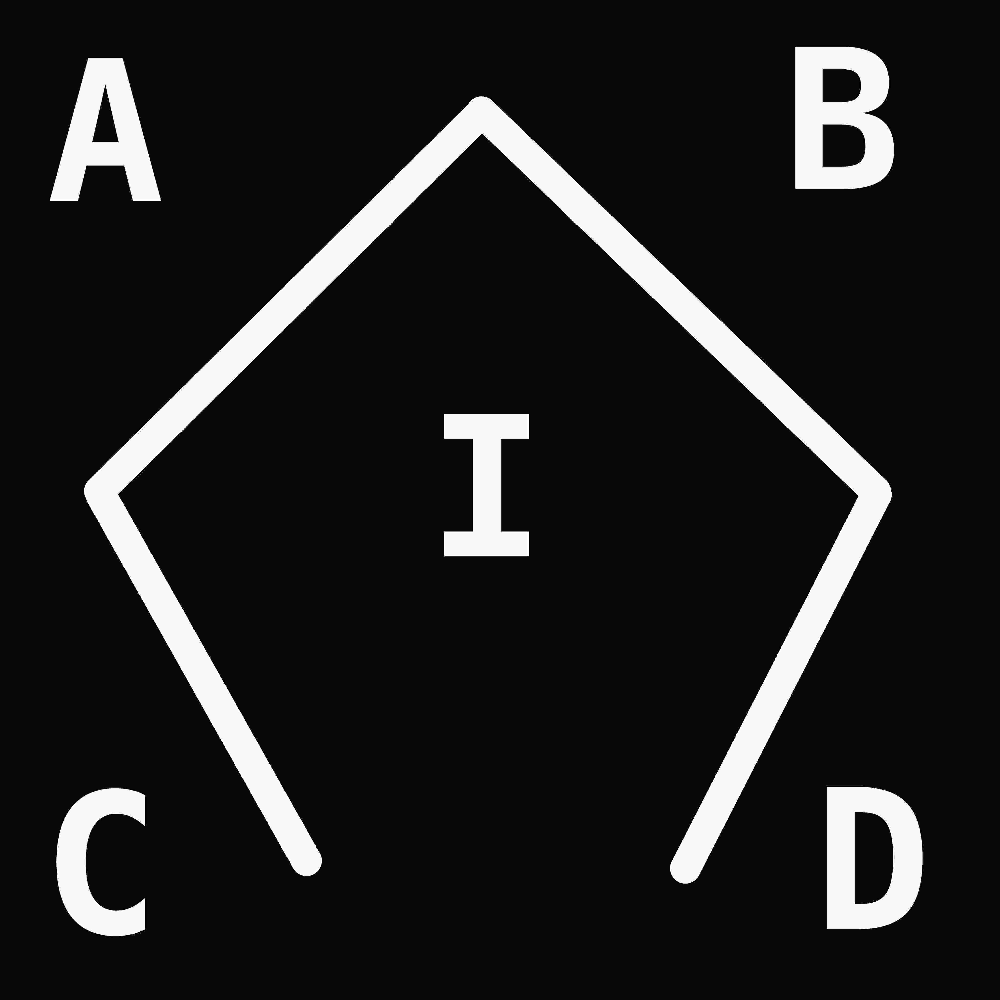
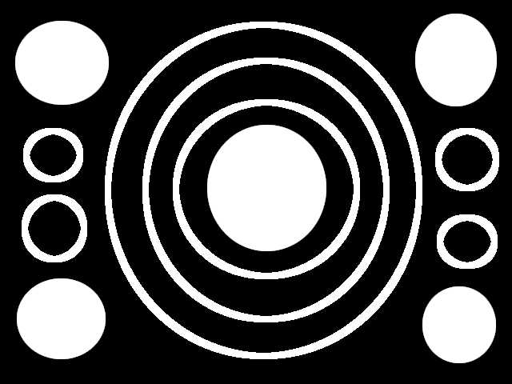
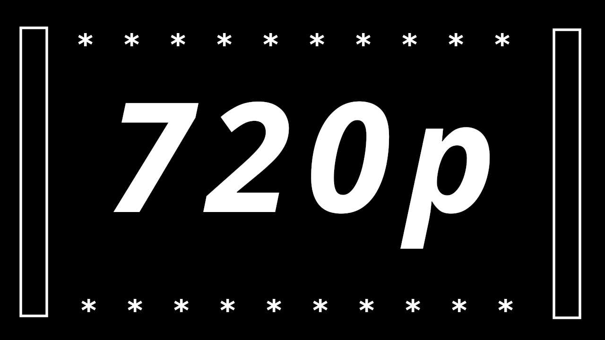

# vhliboptimal_test 0.0.7

## Test suite for shape contour detection and image outline recognition

### Project Source code
Full Source Code on GitHub: [https://github.com/vigatron/vhliboptimal_test](https://github.com/vigatron/vhliboptimal_test)

### Tested Platforms

| Platform / Board             | CPU / MCU        | Arch       | Freq      |
|------------------------------|------------------|------------|-----------|
| ASUS Vivobook                | Intel i5-1135G7  | x86_64     | 2.40 GHz  |
| AMD Based Desktop            | AMD FX-8300      | x86_64     | 3.30 GHz  |
| Orange Pi PC Plus            | ARM Cortex-A7    | ARMv7-A    | 1.20 GHz  |
| Raspberry Pi Model B+ V1.2   | ARM1176JZF-S     | ARMv6      | 700 MHz   |
| CMB32F407HDMIR3              | STM32F407        | Cortex-M4  | 168 MHz   |
| WAVESHARE CORE7XXI           | STM32F746        | Cortex-M7  | 216 MHz   |
| CMB32H750HDMIR1              | STM32H750        | Cortex-M7  | 480 MHz   |
| ESP32-WROOM-32D              | ESP32-D0WD       | Xtensa LX6 | 240 MHz   |

*Rev 0.0.7 Notes:*

* STM32F407:  
    * Optimized for CCMRAM only (BitFields data arrays)  
    * time-critical running in FLASH section faster than in FastRam  
    * Instruction related region (IRAM) not availbale  

* STM32F746:  
    * Optimized for DTCMRAM only (BitFields data arrays)  
    * ITCMRAM optimization pending in this revision.  

* STM32H750:  
    * Optimized for DTCMRAM only (BitFields data arrays)  
    * ITCMRAM optimization pending in this revision.  

* ESP32-D0WD:  
    * Optimized for ESP32 DRAM (BitFields data arrays)  
    * Optimized for ESP32 IRAM (time-critical BitFields routines)  

 

### Test Images Examples

#### Example 1: Image size: 4096*4096 Letters and Geometric shape (Extreme Size Test)

<table>
  <tr>
    <td align="center">
      
    </td>
    <td align="center">
      
    </td>
  </tr>
</table>

#### Example 2: Image size: 4096*4096 Letters and Geometric shape (Extreme Size Test)

<table>
  <tr>
    <td align="center">
      
    </td>
    <td align="center">
      
    </td>
  </tr>
</table>

#### Example 3: Image size: 1920*1080 (1080p) Shapes

<table>
  <tr>
    <td align="center">
      
    </td>
    <td align="center">
      
    </td>
  </tr>
</table>

#### Example 4: Image size: 1920*1080 (1080p) Synthetic Dense Text Block (Extreme Stress Test)

<table>
  <tr>
    <td align="center">
      
    </td>
    <td align="center">
      
    </td>
  </tr>
</table>

#### Example 5: Image size: 640*480 (VGA) Shapes

<table>
  <tr>
    <td align="center">
      
    </td>
    <td align="center">
      
    </td>
  </tr>
</table>

#### Example 6: Image size: 800*600 (SVGA) Text

<table>
  <tr>
    <td align="center">
      
    </td>
    <td align="center">
      
    </td>
  </tr>
</table>

#### Example 7: Image size: 1280 × 720 (HD 720p) Shapes & Text

<table>
  <tr>
    <td align="center">
      
    </td>
    <td align="center">
      
    </td>
  </tr>
</table>

 

## Benchmark Results

rev 0.8.1 - Optimized for `STM32` F4 / F7 / H7  

* CMB32F407HDMIR3 / STM32F407 [GRID 512x512](docs/rev0p8p1/bench_cmb32f407hdmir3_0p8p1_512.txt) | [GRID 256x256](docs/rev0p8p1/bench_cmb32f407hdmir3_0p8p1_256.txt) | [GRID 128x128](docs/rev0p8p1/bench_cmb32f407hdmir3_0p8p1_128.txt)
* WaveShare Core7XXI / STM32F746 [GRID 512x512](log512.txt) | [GRID 256x256](log256.txt) | [GRID 128x128](log128.txt)
* CMB32H750HDMIR1 / STM32H750 [GRID 512x512](log512.txt) | [GRID 256x256](log256.txt) | [GRID 128x128](log128.txt)

rev 0.8.0 - Added `zero-allocation` support with `FIXED_GRID` option for `STM32` & `ESP32`

* [Benchmark results on Intel i5-1135G7](docs/rev0p8p0/bench_intel_i5-1135G7.txt)
* [Benchmark results on AMD FX-8300](docs/rev0p8p0/bench_amd_fx8300.txt)
* [Benchmark results on Orange Pi PC Plus](docs/rev0p8p0/bench_opi_pc_plus.txt)
* [Benchmark results on Raspberry Pi Model B+ V1.2](docs/rev0p8p0/bench_rpi_modelbplus_v1p2.txt)
* [Benchmark results on CMB32F407HDMIR3](docs/rev0p8p0/bench_cmb32f407hdmir3.txt)
* [Benchmark results on WaveShare Core7XXI](docs/rev0p8p0/bench_wavesharecore7xxi.txt)
* [Benchmark results on CMB32H750HDMIR1](docs/rev0p8p0/bench_cmb32h750hdmir1.txt)
* [Benchmark results on ESP32-WROOM-32D initial revision](docs/rev0p8p0/bench_esp32_d0wd.txt)
* [Benchmark results on ESP32-WROOM-32D optimized revision](docs/rev0p8p0/bench_esp32_d0wd_optimized.txt)

rev 0.7.5 - Initial revision for `PC` and `SBC`

* [Benchmark on Intel i5-1135G7 @ 2.40GHz](docs/bench/rev0p7p5/bench_intel_i5-1135G7.md)
* [Benchmark on AMD FX-8300 @ 3.30Ghz](docs/bench/rev0p7p5/bench_amd_fx8300.md)
* [Benchmark on Orange PC Plus ARM Cortex-A7 @ 1.2GHz](docs/bench/rev0p7p5/bench_opi_pc_plus.md)

 

### Dependencies

* vhlibplatform 0.4.2  
[https://github.com/vigatron/vhlibplatform](https://github.com/vigatron/vhlibplatform)  

* vhliboptimal 0.8.1  
[https://github.com/vigatron/vhliboptimal](https://github.com/vigatron/vhliboptimal)  

* vhlibrle7b  0.0.4
[https://github.com/vigatron/vhlibrle7b](https://github.com/vigatron/vhlibrle7b)  

### Build & Run

* [Project compilation for different target platforms](docs/appbuild_and_run.md)

#### Link to resized monochrome .bmp images:  

* [Test Images (#1..#7) with different shapes & text symbols](docs/srcimages.md)

### Common camera image resolutions

| Name      | Resolution      | Aspect ratio |
|-----------|-----------------|--------------|
| VGA       | 640 × 480       | 4:3          |
| SVGA      | 800 × 600       | 4:3          |
| XGA       | 1024 × 768      | 4:3          |
| HD 720p   | 1280 × 720      | 16:9         |
| SXGA      | 1280 × 1024     | 5:4          |
| UXGA      | 1600 × 1200     | 4:3          |
| FHD 1080p | 1920 × 1080     | 16:9         |
| QSXGA     | 2592 × 1944     | 4:3          |
| 4K UHD    | 3840 × 2160     | 16:9         |

---

#### GRID Configuration / Image Tests

* GRID_512x512        SCALE_LV = 9 (512)
* GRID_256x256        SCALE_LV = 8 (256)
* GRID_128x128        SCALE_LV = 7 (128)

---

© 2026 V01G04A81 / Viktor Glebov
