# vhliboptimal_test


### Test suite for shape contour detection and image outline recognition

Dependencies:
* vhliboptimal 0.7.5-beta (optimization in progress; approximately 70% complete)
https://github.com/vigatron/vhliboptimal


##### Example 1: Image size: 4096*4096 Letters and Geometric shape (Extreme Size Test)

<table>
  <tr>
    <td align="center">
      
    </td>
    <td align="center">
      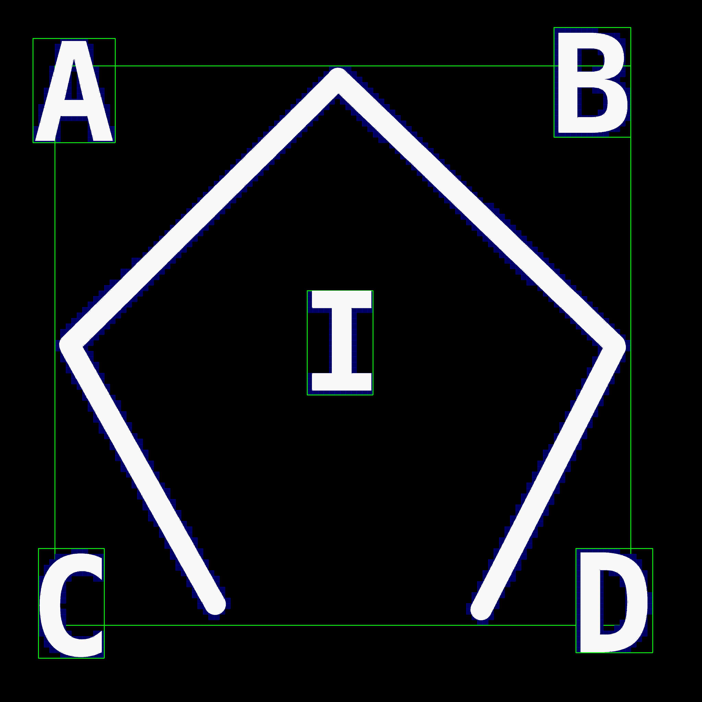
    </td>
  </tr>
</table>

##### Example 2: Image size: 4096*4096 Letters and Geometric shape (Extreme Size Test)

<table>
  <tr>
    <td align="center">
      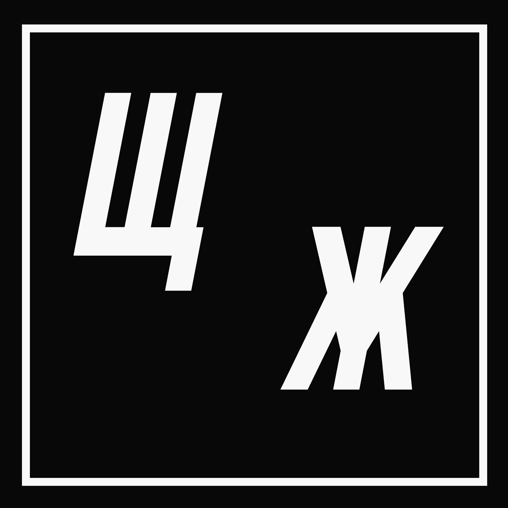
    </td>
    <td align="center">
      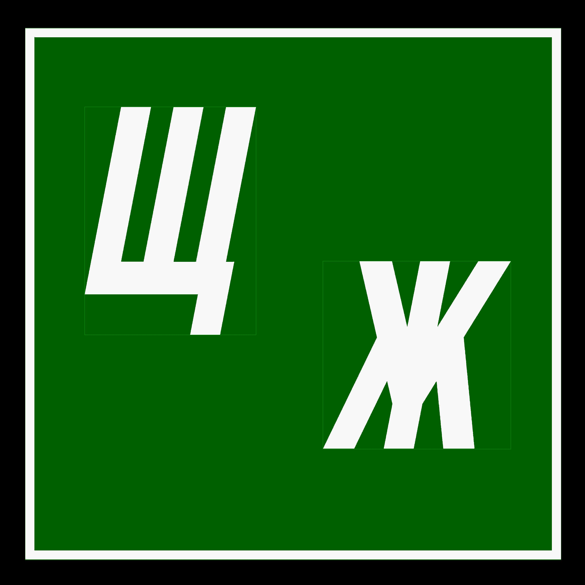
    </td>
  </tr>
</table>

##### Example 3: Image size: 1920*1080 (1080p) Shapes

<table>
  <tr>
    <td align="center">
      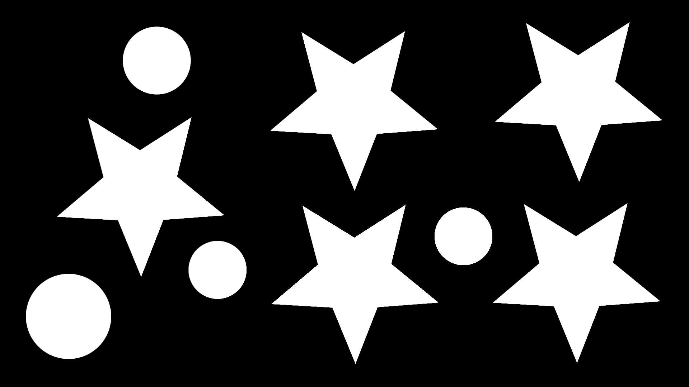
    </td>
    <td align="center">
      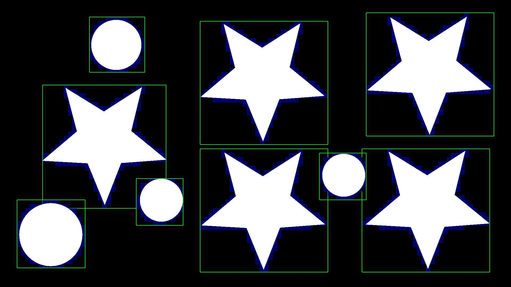
    </td>
  </tr>
</table>

##### Example 4: Image size: 1920*1080 (1080p) Synthetic Dense Text Block (Extreme Stress Test)

<table>
  <tr>
    <td align="center">
      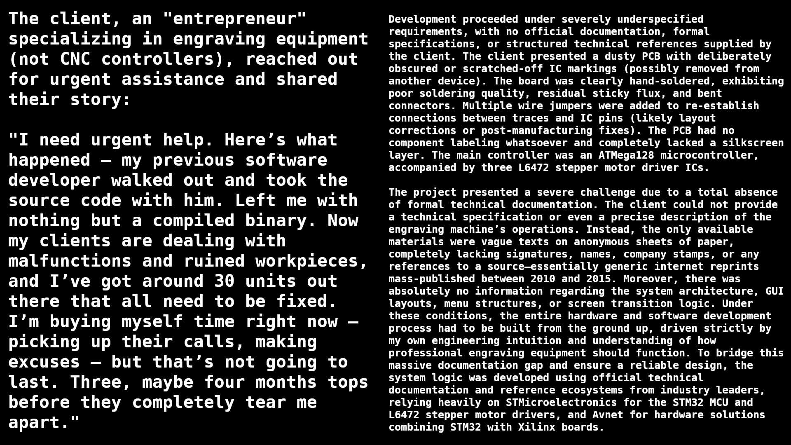
    </td>
    <td align="center">
      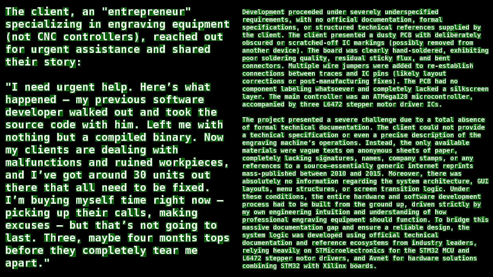
    </td>
  </tr>
</table>

##### Example 5: Image size: 640*480 (VGA) Shapes

<table>
  <tr>
    <td align="center">
      
    </td>
    <td align="center">
      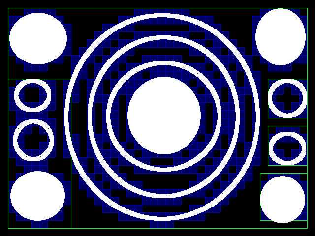
    </td>
  </tr>
</table>

##### Example 6: Image size: 800*600 (SVGA) Text

<table>
  <tr>
    <td align="center">
      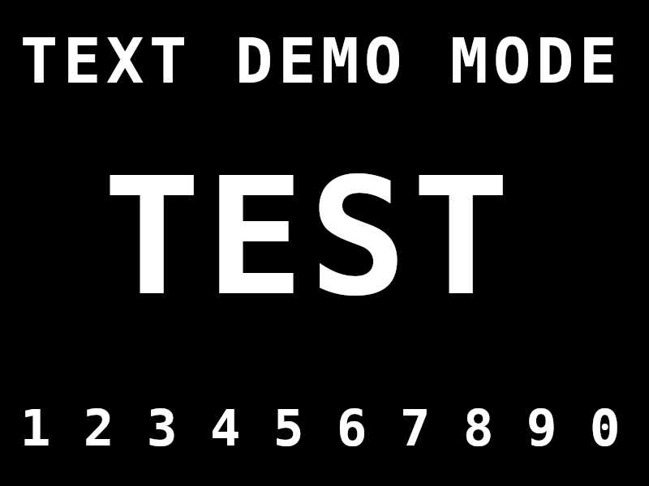
    </td>
    <td align="center">
      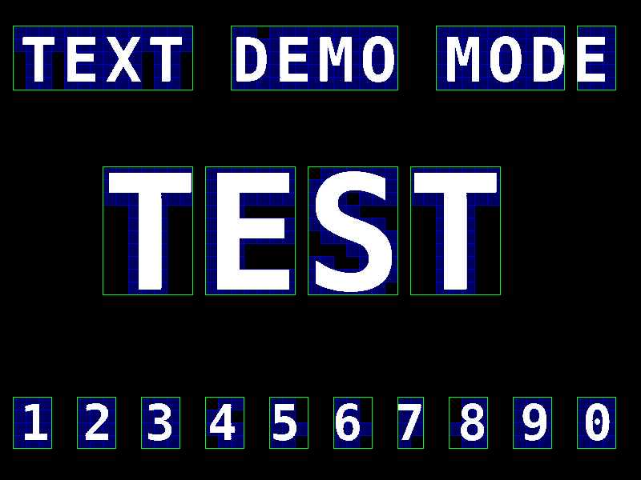
    </td>
  </tr>
</table>

##### Example 7: Image size: 1280 × 720 (HD 720p) Shapes & Text

<table>
  <tr>
    <td align="center">
      
    </td>
    <td align="center">
      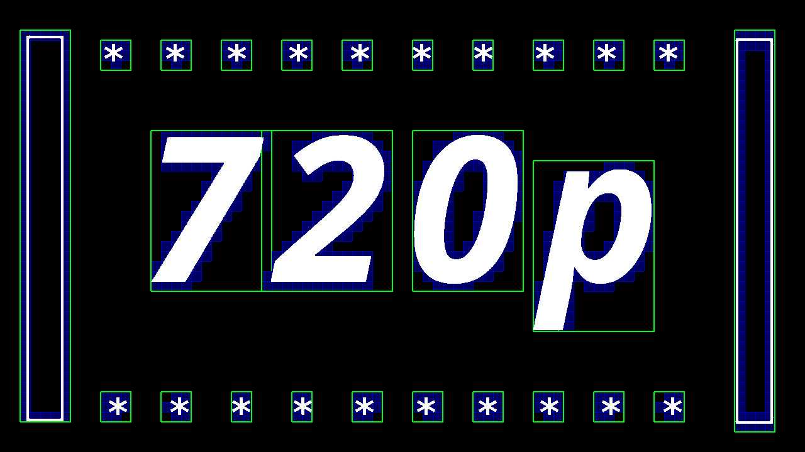
    </td>
  </tr>
</table>

---

### Benchmark Results 1

| Param               | Description |
|---------------------|-------------|
| CPU Model name      | 11th Gen Intel(R) Core(TM) i5-1135G7 @ 2.40GHz |
| Compile Options     | -O3 -march=native -flto -funroll-loops |
| Pass count          | 16 |

<br>

| filename | imageWidth / imageHeight<br>(pixels) | cellsize<br>(pixels) | cellsw<br>(cells) | cellsh<br>(cells) | total<br>(cells) | buffsize<br>(bytes) | objects<br>count | tsmin / tsavg / tsmax (ms)  |
|----------|----------|----------|----------|----------|----------|----------|----------|----------|
| testimage1r4096.jpg | 4096 x 4096 | 4 | 1024 | 1024 | 1048576 | 131072 | 6 | 80 / 80 / 81 |
| testimage1r4096.jpg | 4096 x 4096 | 8 | 512 | 512 | 262144 | 32768 | 6 | 29 / 30 / 31 |
| testimage1r4096.jpg | 4096 x 4096 | 16 | 256 | 256 | 65536 | 8192 | 6 | 12 / 12 / 13 |
| testimage1r4096.jpg | 4096 x 4096 | 32 | 128 | 128 | 16384 | 2048 | 6 | 6 / 6 / 7 |

<br>

| filename | imageWidth / imageHeight<br>(pixels) | cellsize<br>(pixels) | cellsw<br>(cells) | cellsh<br>(cells) | total<br>(cells) | buffsize<br>(bytes) | objects<br>count | tsmin / tsavg / tsmax (ms)  |
|----------|----------|----------|----------|----------|----------|----------|----------|----------|
| testimage2r4096.jpg | 4096 x 4096 | 4 | 1024 | 1024 | 1048576 | 131072 | 3 | 86 / 86 / 87 |
| testimage2r4096.jpg | 4096 x 4096 | 8 | 512 | 512 | 262144 | 32768 | 3 | 25 / 25 / 25 |
| testimage2r4096.jpg | 4096 x 4096 | 16 | 256 | 256 | 65536 | 8192 | 3 | 10 / 10 / 11 |
| testimage2r4096.jpg | 4096 x 4096 | 32 | 128 | 128 | 16384 | 2048 | 3 | 6 / 6 / 6 |

<br>

| filename | imageWidth / imageHeight<br>(pixels) | cellsize<br>(pixels) | cellsw<br>(cells) | cellsh<br>(cells) | total<br>(cells) | buffsize<br>(bytes) | objects<br>count | tsmin / tsavg / tsmax (ms)  |
|----------|----------|----------|----------|----------|----------|----------|----------|----------|
| testimage3r1080p.jpg | 1920 x 1080 | 2 | 960 | 540 | 518400 | 64800 | 9 | 25 / 25 / 26 |
| testimage3r1080p.jpg | 1920 x 1080 | 4 | 480 | 270 | 129600 | 16200 | 9 | 7 / 7 / 8 |
| testimage3r1080p.jpg | 1920 x 1080 | 8 | 240 | 135 | 32400 | 4050 | 9 | 2 / 2 / 3 |
| testimage3r1080p.jpg | 1920 x 1080 | 16 | 120 | 68 | 8160 | 1020 | 9 | 1 / 1 / 1 |

<br>

| filename | imageWidth / imageHeight<br>(pixels) | cellsize<br>(pixels) | cellsw<br>(cells) | cellsh<br>(cells) | total<br>(cells) | buffsize<br>(bytes) | objects<br>count | tsmin / tsavg / tsmax (ms)  |
|----------|----------|----------|----------|----------|----------|----------|----------|----------|
| testimage4r1080p.jpg | 1920 x 1080 | 1 | 1920 | 1080 | 2073600 | 259200 | 2357 | 1389 / 1389 / 1391 |
| testimage4r1080p.jpg | 1920 x 1080 | 2 | 960 | 540 | 518400 | 64800 | 2141 | 317 / 317 / 319 |

<br>

| filename | imageWidth / imageHeight<br>(pixels) | cellsize<br>(pixels) | cellsw<br>(cells) | cellsh<br>(cells) | total<br>(cells) | buffsize<br>(bytes) | objects<br>count | tsmin / tsavg / tsmax (ms)  |
|----------|----------|----------|----------|----------|----------|----------|----------|----------|
| testimage5rvga.jpg | 640 x 480 | 1 | 640 | 480 | 307200 | 38400 | 12 | 28 / 28 / 29 |
| testimage5rvga.jpg | 640 x 480 | 2 | 320 | 240 | 76800 | 9600 | 12 | 5 / 5 / 6 |
| testimage5rvga.jpg | 640 x 480 | 4 | 160 | 120 | 19200 | 2400 | 12 | 1 / 1 / 1 |
| testimage5rvga.jpg | 640 x 480 | 8 | 80 | 60 | 4800 | 600 | 12 | 0 / 0 / 0 |
| testimage5rvga.jpg | 640 x 480 | 16 | 40 | 30 | 1200 | 150 | 5 | 0 / 0 / 0 |

<br>

| filename | imageWidth / imageHeight<br>(pixels) | cellsize<br>(pixels) | cellsw<br>(cells) | cellsh<br>(cells) | total<br>(cells) | buffsize<br>(bytes) | objects<br>count | tsmin / tsavg / tsmax (ms)  |
|----------|----------|----------|----------|----------|----------|----------|----------|----------|
| testimage6rsvga.jpg | 800 x 600 | 1 | 800 | 600 | 480000 | 60000 | 27 | 18 / 18 / 20 |
| testimage6rsvga.jpg | 800 x 600 | 2 | 400 | 300 | 120000 | 15000 | 26 | 4 / 4 / 5 |
| testimage6rsvga.jpg | 800 x 600 | 4 | 200 | 150 | 30000 | 3750 | 26 | 1 / 1 / 1 |
| testimage6rsvga.jpg | 800 x 600 | 8 | 100 | 75 | 7500 | 938 | 26 | 0 / 0 / 0 |
| testimage6rsvga.jpg | 800 x 600 | 16 | 50 | 38 | 1900 | 238 | 18 | 0 / 0 / 0 |

<br>

| filename | imageWidth / imageHeight<br>(pixels) | cellsize<br>(pixels) | cellsw<br>(cells) | cellsh<br>(cells) | total<br>(cells) | buffsize<br>(bytes) | objects<br>count | tsmin / tsavg / tsmax (ms)  |
|----------|----------|----------|----------|----------|----------|----------|----------|----------|
| testimage7r720p.jpg | 1280 x 720 | 1 | 1280 | 720 | 921600 | 115200 | 26 | 37 / 37 / 39 |
| testimage7r720p.jpg | 1280 x 720 | 2 | 640 | 360 | 230400 | 28800 | 26 | 9 / 9 / 10 |
| testimage7r720p.jpg | 1280 x 720 | 4 | 320 | 180 | 57600 | 7200 | 26 | 3 / 3 / 3 |
| testimage7r720p.jpg | 1280 x 720 | 8 | 160 | 90 | 14400 | 1800 | 26 | 1 / 1 / 1 |
| testimage7r720p.jpg | 1280 x 720 | 16 | 80 | 45 | 3600 | 450 | 26 | 0 / 0 / 0 |


---

### Benchmark Results 2

| Param               | Description |
|---------------------|-------------|
| CPU Model name      | CPU Model name: AMD FX(tm)-8300 Eight-Core Processor |
| Compile Options     | -O3 -march=native -flto -funroll-loops |
| Pass count          | 16 |


<br>

| filename | imageWidth / imageHeight<br>(pixels) | cellsize<br>(pixels) | cellsw<br>(cells) | cellsh<br>(cells) | total<br>(cells) | buffsize<br>(bytes) | objects<br>count | tsmin / tsavg / tsmax (ms)  |
|----------|----------|----------|----------|----------|----------|----------|----------|----------|
| testimage1r4096.jpg | 4096 x 4096 | 4 | 1024 | 1024 | 1048576 | 131072 | 6 | 183 / 183 / 188 |
| testimage1r4096.jpg | 4096 x 4096 | 8 | 512 | 512 | 262144 | 32768 | 6 | 83 / 84 / 85 |
| testimage1r4096.jpg | 4096 x 4096 | 16 | 256 | 256 | 65536 | 8192 | 6 | 44 / 44 / 46 |
| testimage1r4096.jpg | 4096 x 4096 | 32 | 128 | 128 | 16384 | 2048 | 6 | 26 / 26 / 28 |

<br>

| filename | imageWidth / imageHeight<br>(pixels) | cellsize<br>(pixels) | cellsw<br>(cells) | cellsh<br>(cells) | total<br>(cells) | buffsize<br>(bytes) | objects<br>count | tsmin / tsavg / tsmax (ms)  |
|----------|----------|----------|----------|----------|----------|----------|----------|----------|
| testimage2r4096.jpg | 4096 x 4096 | 4 | 1024 | 1024 | 1048576 | 131072 | 3 | 195 / 195 / 198 |
| testimage2r4096.jpg | 4096 x 4096 | 8 | 512 | 512 | 262144 | 32768 | 3 | 69 / 69 / 70 |
| testimage2r4096.jpg | 4096 x 4096 | 16 | 256 | 256 | 65536 | 8192 | 3 | 37 / 37 / 38 |
| testimage2r4096.jpg | 4096 x 4096 | 32 | 128 | 128 | 16384 | 2048 | 3 | 25 / 25 / 26 |

<br>

| filename | imageWidth / imageHeight<br>(pixels) | cellsize<br>(pixels) | cellsw<br>(cells) | cellsh<br>(cells) | total<br>(cells) | buffsize<br>(bytes) | objects<br>count | tsmin / tsavg / tsmax (ms)  |
|----------|----------|----------|----------|----------|----------|----------|----------|----------|
| testimage3r1080p.jpg | 1920 x 1080 | 2 | 960 | 540 | 518400 | 64800 | 9 | 54 / 54 / 57 |
| testimage3r1080p.jpg | 1920 x 1080 | 4 | 480 | 270 | 129600 | 16200 | 9 | 16 / 16 / 17 |
| testimage3r1080p.jpg | 1920 x 1080 | 8 | 240 | 135 | 32400 | 4050 | 9 | 6 / 6 / 10 |
| testimage3r1080p.jpg | 1920 x 1080 | 16 | 120 | 68 | 8160 | 1020 | 9 | 2 / 2 / 5 |

<br>

| filename | imageWidth / imageHeight<br>(pixels) | cellsize<br>(pixels) | cellsw<br>(cells) | cellsh<br>(cells) | total<br>(cells) | buffsize<br>(bytes) | objects<br>count | tsmin / tsavg / tsmax (ms)  |
|----------|----------|----------|----------|----------|----------|----------|----------|----------|
| testimage4r1080p.jpg | 1920 x 1080 | 1 | 1920 | 1080 | 2073600 | 259200 | 2357 | 3282 / 3285 / 3289 |
| testimage4r1080p.jpg | 1920 x 1080 | 2 | 960 | 540 | 518400 | 64800 | 2141 | 751 / 752 / 754 |

<br>

| filename | imageWidth / imageHeight<br>(pixels) | cellsize<br>(pixels) | cellsw<br>(cells) | cellsh<br>(cells) | total<br>(cells) | buffsize<br>(bytes) | objects<br>count | tsmin / tsavg / tsmax (ms)  |
|----------|----------|----------|----------|----------|----------|----------|----------|----------|
| testimage5rvga.jpg | 640 x 480 | 1 | 640 | 480 | 307200 | 38400 | 12 | 62 / 62 / 67 |
| testimage5rvga.jpg | 640 x 480 | 2 | 320 | 240 | 76800 | 9600 | 12 | 12 / 12 / 17 |
| testimage5rvga.jpg | 640 x 480 | 4 | 160 | 120 | 19200 | 2400 | 12 | 2 / 2 / 3 |
| testimage5rvga.jpg | 640 x 480 | 8 | 80 | 60 | 4800 | 600 | 12 | 1 / 1 / 2 |
| testimage5rvga.jpg | 640 x 480 | 16 | 40 | 30 | 1200 | 150 | 5 | 0 / 0 / 0 |

<br>

| filename | imageWidth / imageHeight<br>(pixels) | cellsize<br>(pixels) | cellsw<br>(cells) | cellsh<br>(cells) | total<br>(cells) | buffsize<br>(bytes) | objects<br>count | tsmin / tsavg / tsmax (ms)  |
|----------|----------|----------|----------|----------|----------|----------|----------|----------|
| testimage6rsvga.jpg | 800 x 600 | 1 | 800 | 600 | 480000 | 60000 | 27 | 40 / 40 / 44 |
| testimage6rsvga.jpg | 800 x 600 | 2 | 400 | 300 | 120000 | 15000 | 26 | 9 / 9 / 13 |
| testimage6rsvga.jpg | 800 x 600 | 4 | 200 | 150 | 30000 | 3750 | 26 | 3 / 3 / 6 |
| testimage6rsvga.jpg | 800 x 600 | 8 | 100 | 75 | 7500 | 938 | 26 | 1 / 1 / 2 |
| testimage6rsvga.jpg | 800 x 600 | 16 | 50 | 38 | 1900 | 238 | 18 | 0 / 0 / 2 |

<br>

| filename | imageWidth / imageHeight<br>(pixels) | cellsize<br>(pixels) | cellsw<br>(cells) | cellsh<br>(cells) | total<br>(cells) | buffsize<br>(bytes) | objects<br>count | tsmin / tsavg / tsmax (ms)  |
|----------|----------|----------|----------|----------|----------|----------|----------|----------|
| testimage7r720p.jpg | 1280 x 720 | 1 | 1280 | 720 | 921600 | 115200 | 26 | 82 / 87 / 96 |
| testimage7r720p.jpg | 1280 x 720 | 2 | 640 | 360 | 230400 | 28800 | 26 | 19 / 20 / 23 |
| testimage7r720p.jpg | 1280 x 720 | 4 | 320 | 180 | 57600 | 7200 | 26 | 6 / 6 / 7 |
| testimage7r720p.jpg | 1280 x 720 | 8 | 160 | 90 | 14400 | 1800 | 26 | 2 / 2 / 5 |
| testimage7r720p.jpg | 1280 x 720 | 16 | 80 | 45 | 3600 | 450 | 26 | 1 / 1 / 3 |

<br>

---

### Benchmark Results 3

| Param               | Description |
|---------------------|-------------|
| CPU Model name      | Orange Pi PC Plus (Allwinner H3, ARM Cortex-A7, ARMv7-A, 32-bit) |
| Compile Options     | -O3 -march=native -mfloat-abi=hard -fomit-frame-pointer -flto -funroll-loops |
| Pass count          | 16 |


<br>


<br>


<br>


<br>


<br>

*Note: Objects do not disappear at higher cell sizes; some simply merge together due to downsampling.*


## Сборка проекта под разные платформы

### Intel i5-1135G7

```bash
mkdir build-intel && cd build-intel
cmake -DCMAKE_TOOLCHAIN_FILE=../toolchain-intel.cmake ..
make -j$(nproc)
```

### AMD FX-8300

```bash
mkdir build-amd && cd build-amd
cmake -DCMAKE_TOOLCHAIN_FILE=../toolchain-amd.cmake ..
make -j$(nproc)
```

### Orange Pi PC Plus (ARM Cortex-A7)

```bash
mkdir build-arm && cd build-arm
cmake -DCMAKE_TOOLCHAIN_FILE=../toolchain-opi-pc-plus.cmake ..
make -j2
```

## Common camera image resolutions

| Name      | Resolution      | Aspect ratio |
|-----------|-----------------|--------------|
| VGA       | 640 × 480       | 4:3          |
| SVGA      | 800 × 600       | 4:3          |
| XGA       | 1024 × 768      | 4:3          |
| HD 720p   | 1280 × 720      | 16:9         |
| SXGA      | 1280 × 1024     | 5:4          |
| UXGA      | 1600 × 1200     | 4:3          |
| FHD 1080p | 1920 × 1080     | 16:9         |
| QSXGA     | 2592 × 1944     | 4:3          |
| 4K UHD    | 3840 × 2160     | 16:9         |

© 2026 V01G04A81 / Viktor Glebov

