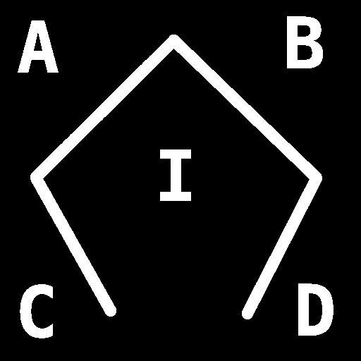
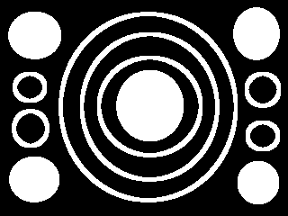

#### Test Images

<table>
    <tr>
        <td align="left">
            <b>Example #1</b> 
            Original: 4096*4096 
            Resized : 512*512 
            
        </td>
    </tr>
</table>

 

<table>
    <tr>
        <td align="left">
        <b>Example #2</b> 
        Original: 4096*4096 
        Resized : 512*512 
        
           
        </td>
    </tr>
</table>

 

<table>
    <tr>
        <td align="left">
        <b>Example #3</b> 
        Original: 1920*1080 (1080p) 
        Resized : 480*270 
        
           
        </td>
    </tr>
</table>

 

<table>
    <tr>
        <td align="left">
        <b>Example #4</b> 
        Original: 1920*1080 (1080p) 
        Resized : 480*270 
        
           
        </td>
    </tr>
</table>

 

<table>
    <tr>
        <td align="left">
        <b>Example #5</b> 
        Original: 640*480 (VGA) 
        Resized : 320*240 
        
           
        </td>
    </tr>
</table>

 

<table>
    <tr>
        <td align="left">
        <b>Example #6</b> 
        Original: 800*600 (SVGA) 
        Resized : 400*300 
        
           
        </td>
    </tr>
</table>

 

<table>
    <tr>
        <td align="left">
        <b>Example #7</b> 
        Original: 1280*720 
        Resized : 320*180 
        
           
        </td>
    </tr>
  </tr>
</table>
